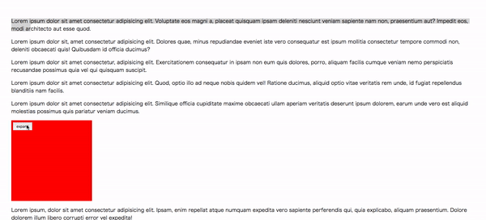

# ui-expand



## Install

```
$ npm install ui-expand --save
```

```js
import Expand from 'ui-expand'
```

### CDN

```html
<script src="https://unpkg.com/ui-expand@latest/js/ui-expand.min.js"></script>
```

## Usage

```html
<div class="js-expand">
  <button class="js-expand-btn">expand</button>
    <p>Lorem ipsum dolor sit amet consectetur adipisicing elit. Laboriosam, delectus vitae voluptas, corrupti ea expedita velit veniam accusamus repellat ex non esse ipsa harum laudantium veritatis excepturi, sapiente qui. Excepturi.</p>
  </div>
</div>
```

```js
new Expand('.js-expand', {
  trigger: '.js-expand-btn' //it should be inside `.js-expand`
});
```

## Event

```js
new Expand('.js-expand', {
  trigger: '.js-expand-btn',
  beforeOpen: (element, trigger) => { //before expand

  },
  onOpen: (element, trigger) => { // after expand

  },
  beforeClose: (element, trigger) => { // before close

  },
  onClose: (element, trigger) => { // after close

  }
});
```
